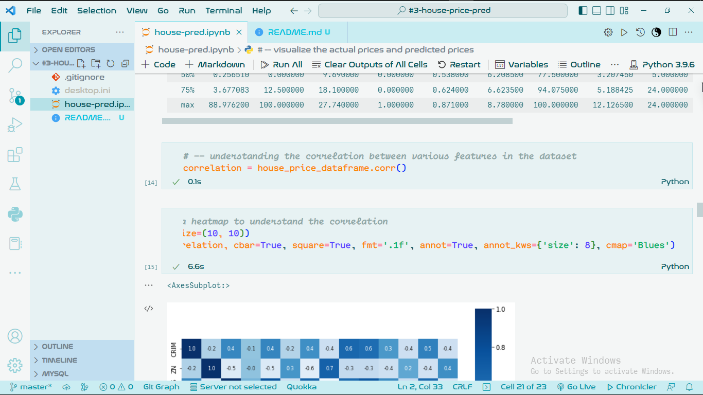
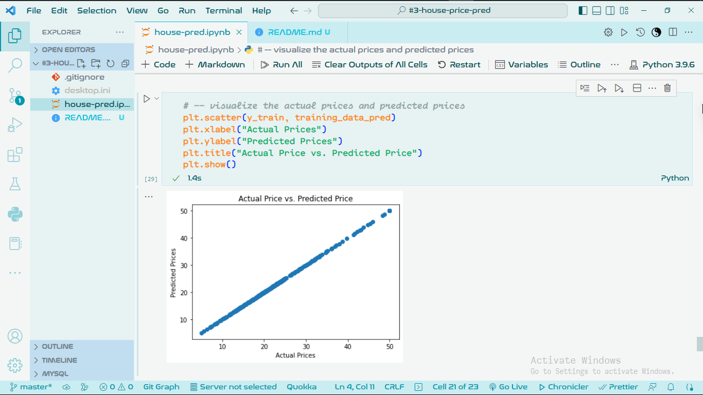

# Setup

Follow vividly this instructions to set up  the project.

1. [VSCode Installation](#vscode-installation)
1. [Python Installation](#python-installation)
1. [Extensions Installation](#extensions-installation)
1. [Install Dependencies](#install-dependencies)
1. [Download Project](#download-project)

## VSCode Installation

- [Download VSCode](https://code.visualstudio.com/download)
- During the installation, add VSCode to path.

## Python Installation

- [Download Python](https://www.python.org/downloads/)
- During the installation, add Python to path.

## Extensions Installation

Install the following extensions on VSCode.

- Python
- Pylance
- Jupyter
- Jupyter Notebook Renderers
- GitLens

## Install Dependencies

Open the command line and run this command.
`pip install numpy pandas sklearn xgboost`

## Download Project

Follow either ways to get this project to your PC

1. Download the project and extract it. Right click and open the project in VSCode.
1. Clone the repository in *C:/dir/project-dir/*. Right click and open the project in VSCode.

Enjoy!
